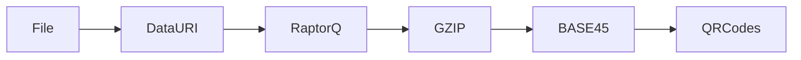

# emblem.red

POST IETF 120 Weekend Project.

Digital Emblems built with CBOR, COSE, Key Transparency, Raptor Codes and TLSA Records.

Emblems are COSE Objects encoded as Files / Data URIs.

### [message.txt](message.txt) becomes:


How the animated QR Codes Work:



Based on previous work done in [transmute.codes](https://github.com/transmute-industries/transmute.codes), and inspired by:

- https://datatracker.ietf.org/doc/draft-steele-spice-cryptovolense/
- https://datatracker.ietf.org/doc/draft-steele-spice-tlsa-cnf/

Check credential bindings via DNS:

```bash
dig @pam.ns.cloudflare.com. d999ac786ac4e00ad8da8d5be69de997.f0c429e4abd8c3f158012c078467c20c.emblem.red. TLSA
```

Or

```bash
curl -s --http2 -H "accept: application/dns-json" "https://1.1.1.1/dns-query?name=emblem.red&type=TLSA" | jq '.'
```

## License

Licensed under

 * Apache License, Version 2.0 ([LICENSE](LICENSE) or http://www.apache.org/licenses/LICENSE-2.0)

### Contribution

Unless you explicitly state otherwise, any contribution intentionally submitted
for inclusion in the work by you shall be licensed as above, without any
additional terms or conditions.
