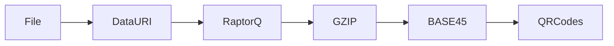

# emblem.red

POST IETF 120 Weekend Project.

Digital Emblems built with CBOR, COSE, Key Transparency, Raptor Codes and TLSA Records.

Emblems are COSE Objects encoded as Files / Data URIs.

### Example:

CBOR Extended Diagnostic Notation:

```
18([
  <<{
    / Signature Algorithm    / 1: -7, 
    / Payload Hash Algorithm / -6800: -16, 
    / Location of Payload /
    -6801: "https://ihl-databases.icrc.org/en/customary-ihl/v1/rule29"
    / Content Type of Payload /
    -6802: "application/emblem+json",
  }>>, 
  {
    / Transparency Receipts / 394: [<<
      18([
        <<{
          / Signature Algorithm    / 1: -7, 
          / Transparency Algorithm / 395: 1
        }>>, 
        / Transparency Proofs / { 396: {
          -1: [<<[
            / Log Size / 4, 
            / Entry Index / 3, 
            / Inclusion Path / [h'0b317603a297...f074cf65d1ea6', h'2266e9ddea46...31821f94e92e7']
          ]>>]
        } }, 
        null, / Detached Payload is Merkle Tree Head /
        h'792ae3b6290bc8f47a189dbe63...781c49e1e762b0401aae0e'
      ])
    >>]
  }, 
  / sha-256 hash of {"message":"🀄 This target is protected under international law."} /
  h'd999ac786ac4e00ad8da8d5be69de997f0c429e4abd8c3f158012c078467c20c', 
  h'394c769c42b...405c977a6ac2'
])
```

Becomes:


How the animated QR Codes Work:



Based on previous work done in [transmute.codes](https://github.com/transmute-industries/transmute.codes), and inspired by:

- https://datatracker.ietf.org/doc/draft-steele-spice-cryptovolense/
- https://datatracker.ietf.org/doc/draft-steele-spice-tlsa-cnf/

Check credential bindings via DNS:

```bash
dig @pam.ns.cloudflare.com. d999ac786ac4e00ad8da8d5be69de997.f0c429e4abd8c3f158012c078467c20c.emblem.red. TLSA
```

Or

```bash
curl -s --http2 -H "accept: application/dns-json" "https://1.1.1.1/dns-query?name=emblem.red&type=TLSA" | jq '.'
```

## Problems with this approach.

1. The current demo sends text data instead of cbor... this makes verification take longer than normal.
1. There is no proof of posession binding, so anyone with the gif can display the emblem (could be a feature or a bug)
1. This is a demo, and does not perform any real cryptographic checks, it just does encoding and decoding.
1. There is no DNS confirmation, although both the payload hash and public key hash are registered in TLSA records.
1. Only tested on pixel 5, and logitech C925e... works on both, slow on pixel 5, because of data density and camera resolution.

## License

Licensed under

 * Apache License, Version 2.0 ([LICENSE](LICENSE) or http://www.apache.org/licenses/LICENSE-2.0)

### Contribution

Unless you explicitly state otherwise, any contribution intentionally submitted
for inclusion in the work by you shall be licensed as above, without any
additional terms or conditions.
